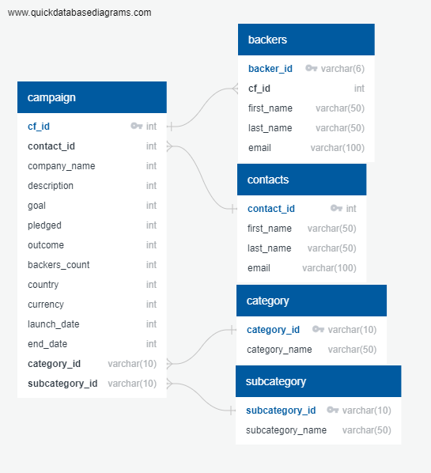

# Crowdfunding-ETL

## Overview

### Purpose
Use Python, Pandas, and Jupyter notebooks to do the extract and transform phases.

### Background
Independent Funding has just received a new dataset that contains information about the backers who’ve pledged to the live projects. And, Independent Funding wants you and Britta to perform both an ETL process on this dataset.

## Results

First, The data was extracted, then transformed and cleaned.
This is shown in the jupyter notebook linked below

[Extract-Transform_final_code.ipynb](Extract-Transform_final_code.ipynb)

Second, an ERD and Table Schema were created and the data was loaded.
This is shown below.

[crowdfunding_db_schema.sql](crowdfunding_db_schema.sql)
